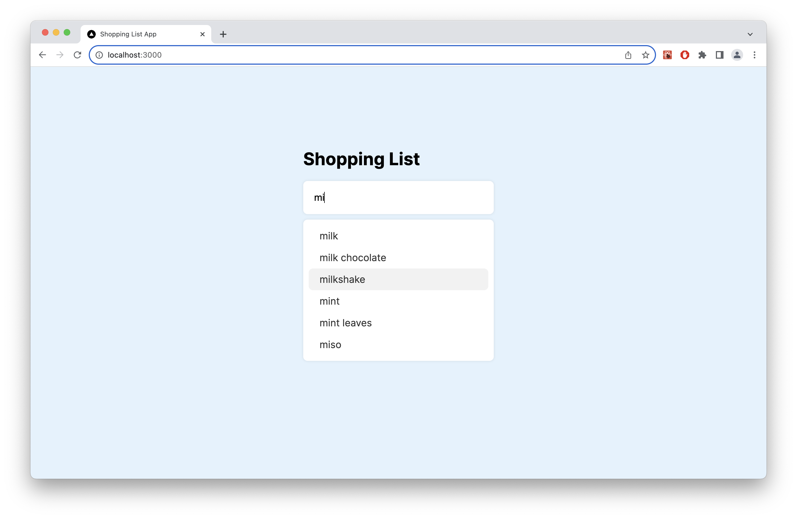
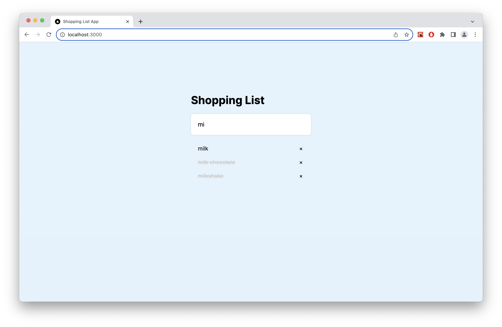

# ShoppingList

A react shoppinglist applicaion.

## Features

- Using Debounce to control fetch data from API.
- Can multi-select items then `FocusOut` to hide, `Click` to show dropdown list.
- Support Keyboard event:
  - `ArrowUp`, `ArrowDown`: open and select item in menu
  - `Enter`: add to shopping list
  - `Escape`: close dropdown menu
- Setting items amount
- Click item to striket it out and click Close button to delete item.

## Getting Started

First, run the development server:

```bash
npm run dev
```

Open [http://localhost:3000](http://localhost:3000) with your browser to see the result.

## Snapshot




## CSS template (tmpl/)

- SelectionMenu
